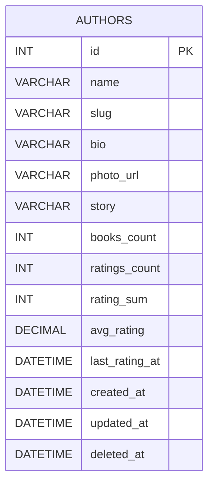

# 📦 Authors

   

<!-- Auto-generated from schema-map.psd1 @ 6cefe8e (2025-10-22T20:27:41+02:00) -->

> Schema package for table **authors** (repo: `authors`).

## Files
```
schema/
  001_table.sql
  # (no deferred indexes declared in map)
  # (no foreign keys declared in map)
```

## Quick apply
```bash
# Apply schema (Linux/macOS):
mysql -h "$DB_HOST" -u "$DB_USER" -p"$DB_PASS" "$DB_NAME" < schema/001_table.sql
```

```powershell
# Apply schema (Windows PowerShell):
mysql -h $env:DB_HOST -u $env:DB_USER -p$env:DB_PASS $env:DB_NAME < schema/001_table.sql
```

## Docker quickstart
```bash
# Spin up a throwaway MySQL and apply just this package:
docker run --rm -e MYSQL_ROOT_PASSWORD=root -e MYSQL_DATABASE=app -p 3307:3306 -d mysql:8
sleep 15
mysql -h 127.0.0.1 -P 3307 -u root -proot app < schema/001_table.sql
```

## Columns
| Column | Type | Null | Default | Extra |
|-------:|:-----|:----:|:--------|:------|
| id | BIGINT UNSIGNED | — | — | AUTO_INCREMENT, PK |
| name | VARCHAR(255) | NO | — |  |
| slug | VARCHAR(255) | NO | — |  |
| bio | TEXT | YES | — |  |
| photo_url | VARCHAR(255) | YES | — |  |
| story | LONGTEXT | YES | — |  |
| books_count | INT | NO | 0 |  |
| ratings_count | INT | NO | 0 |  |
| rating_sum | INT | NO | 0 |  |
| avg_rating | DECIMAL(3,2) | YES | NULL |  |
| last_rating_at | DATETIME(6) | YES | — |  |
| created_at | DATETIME(6) | NO | CURRENT_TIMESTAMP(6) |  |
| updated_at | DATETIME(6) | NO | CURRENT_TIMESTAMP(6) |  |
| deleted_at | DATETIME(6) | YES | — |  |

## Relationships
- No outgoing foreign keys.



## Indexes
- No deferred indexes declared for this table.

## Notes
- Generated from the umbrella repository **blackcat-database** using `scripts/schema-map.psd1`.
- To change the schema, update the map and re-run the generators.

## License
Distributed under the **BlackCat Store Proprietary License v1.0**. See `LICENSE`.
